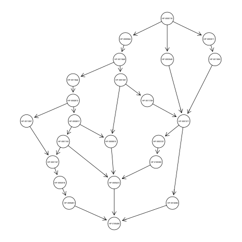

.. role:: R(code)
   :language: R

.. _tutorials:

================================
Tutorials
================================

Here we show a step-by-step application of ``HEMDAG`` to the hierarchical prediction of associations between human gene and abnormal phenotype. To this end we will use the small pre-build dataset available in the ``HEMDAG`` library. Nevertheless, you can perform the examples shown below by using the full dataset downloadable at the following `link <https://homes.di.unimi.it/notaro/DATA/DATA_BMC/>`__.

.. note::
	By using the full dataset the running time of the parametric ensemble variants is quite higher due to the tuning of the hyper-parameter...

Reminder: to load an ``rda'' file in the ``R`` environment just type:

 .. code-block:: R

	load("path_to_file.rda");

Loading the Flat Scores Matrix
===============================
In their more general form, the hierarchical ensemble methods adopt a two-step learning strategy: the first step consists in the flat learning of the ontology terms, while the second step *reconciles* the flat predictions by considering the topology of the ontology. Hence, the first 'ingredient' that we need is the flat scores matrix. For the sake of simplicity, in the examples shown below we make use of the prebuilt dataset available in the ``HEMDAG`` library. Then to load the flat scores matrix, open the ``R`` environment and type:

 .. code-block:: R

	library(HEMDAG);
	data(scores);

with the above command we load the flat scores matrix ``S``, that is a named ``100 X 23`` matrix. Rows correspond to genes (``Entrez GeneID``) and columns to ``HPO`` terms/classes. The scores representing the likelihood that a given gene belongs to a given class: higher the value higher the likelihood. This flat scores matrix was obtained by running the ``RANKS`` package (`link <https://cran.rstudio.com/web/packages/RANKS/>`__).

Loading the DAG
==================
In order to know the hierarchical structure of the ``HPO`` terms, we must load the graph:

 .. code-block:: R

	data(graph);

with the above command we load the graph ``g``, an object of class ``graphNEL``. The graph ``g`` has ``23`` nodes and ``30`` edges and represents the *ancestors view* of the ``HPO`` term ``Camptodactyly of finger`` (`HP:0100490 <http://compbio.charite.de/hpoweb/showterm?id=HP:0100490#id=HP_0100490>`_). Obviously, the nodes of the graph ``g`` correspond to classes of the flat scores matrix ``S``.

Optional step: plotting the graph ``g``
-------------------------------------------

.. note::
    You need to install the `Rgraphviz` package. Yo can install it for example via conda: `conda install -c bioconda bioconductor-rgraphviz`

If you want to visualize the *ancestors view* of the term ``HP:0100490``, just type:

 .. code-block:: R

	library(Rgraphviz);
	plot(g);

Be sure to have correctly installed the ``Rgraphviz`` before running the above command.

Scores Normalization
======================
Before running any hierarchical ensemble algorithm, we must normalize the scores of the flat matrix to make the flat scores comparable with those hierarchical. `HEMDAG`` allows to normalize the flat scores according to two different procedures:

1. **MaxNorm**: Normalization in the sense of the maximum: the score of each class is normalized by dividing the score values for the maximum score of that class:

 .. code-block:: R

	maxnorm <- normalize.max(S);

2. **Qnorm**: Quantile normalization: quantile normalization of the ``preprocessCore`` package is used (`link <https://bioconductor.org/packages/release/bioc/html/preprocessCore.html>`_):

 .. code-block:: R

	library(preprocessCore);
	qnrom <- normalize.quantiles(S);

Be sure to install the ``preprocessCore`` package before running the above command.

For all the examples shown below, we normalize the flat scores matrix by applying the **MaxNorm**:

 .. code-block:: R

 	S <- normalize.max(S);

Running Hierarchical Ensemble Methods
=========================================
First of all, we need to find the root node (i.e. node that is at the top-level of the hierarchy) of the ``HPO`` graph ``g``. To do that just type:

 .. code-block:: R

	root <- root.node(g);

in this way we store in the variable ``root`` the root node of the graph ``g``.

Before applying any ensemble variants, we need to remove the root node from the flat scores matrix (if any). Indeed it does not make sense at all to take into account the predictions on the root node, since it is a *fake* node added to the ontology for practical reasons (e.g. some graph-based software may require a single root node to work). In ``R`` this can be accomplished in one line of code:

 .. code-block:: R

 	if(root %in% colnames(S))
		S <- S[,-which(colnames(S)==root)];

Now, we are ready to run any ensemble algorithms implemented in the ``HEMDAG`` package. Depending on which ensemble variant you want to call, you must execute one of the command shown below:

HTD-DAG: Hierarchical Top Down for DAG
--------------------------------------

 .. code-block:: R

	S.htd <- htd(S,g,root);

TPR-DAG: True Path Rule for DAG
--------------------------------------
``TPR-DAG`` is a family of algorithms in according to the bottom-up approach adopted for the choice of the *positive* children.

 .. code-block:: R

	S.tprTF <- tpr.threshold.free(S,g,root);
	S.tprT <- tpr.threshold(S,g,root,t=0.5);
	S.tprW <- tpr.weighted.threshold.free(S,g,root,w=0.5);
	S.tprWT <- tpr.weighted.threshold(S,g,root,w=0.5, t=0.5);

DESCENS: Descendants Ensemble Classifier
------------------------------------------------
``DESCENS`` is a family of algorithm in according to the bottom-up approach adopted for the choice of the *positive* descendants.

 .. code-block:: R

	S.descensTF <- descens.threshold.free(S,g,root);
	S.descensT <- descens.threshold(S,g,root,t=0.5);
	S.descensW <- descens.weighted.threshold.free(S,g,root,w=0.5);
	S.descensWT <- descens.weighted.threshold(S,g,root,w=0.5, t=0.5);
	S.descensTAU <- descens.tau(S,g,root, t=0.5);

Hierarchical Constraints Check
-----------------------------------
The predictions returned by our ensemble methods always obey to the **True Path Rule**: positive instance for a class implies positive instance for all the ancestors of that class. To show this fact we can apply the function ``check.hierarchy``:

 .. code-block:: R

	check.hierarchy(S,g,root)$Status
	[1] "NOTOK"

	check.hierarchy(S.htd,g,root)$Status
	[1] "OK"

Obviously, all the ensemble variants hold this property, for instance:

 .. code-block:: R

	check.hierarchy(S.tprTF,g,root)$Status
	[1] "OK"

	check.hierarchy(S.descensW,g,root)$Status
	[1] "OK"

Performance Evaluation
----------------------------------
To know the ensemble methods behavior, the ``HEMDAG`` library, by exploiting both ``precrec`` and ``PerfMeas`` package, provides several performance metrics:
- ``AUROC``: Area under the ``ROC`` curve;
- ``AUPRC``: Area under the Precision-Recall curve;
- ``F-score``: Harmonic mean between precision and Recall (cite cafa2 paper);
- ``PXR``: precision at different recall levels;

It is worth noting that ``HEMDAG`` allows to compute all the aforementioned metrics either one-shot or averaged across ``k`` fold.

Loading the Annotation Matrix
~~~~~~~~~~~~~~~~~~~~~~~~~~~~~~~~
To compare the hierarchical ensemble methods against the flat approach, we need of the annotations matrix:

 .. code-block:: R

	data(labels);

with the above command we load the annotations table ``L``, that is a named ``100 X 23`` matrix. Rows correspond to genes (``Entrez GeneID``) and columns to ``HPO`` terms/classes. ``L[i, j] = 1`` means that the gene ``i`` belong to class ``j``, ``L[i, j] = 0`` means that the gene ``i`` does not belong to class ``j``.

Flat vs Hierarchical
~~~~~~~~~~~~~~~~~~~~~~~
Firstly, we need to remove the root node from the annotations matrix:

 .. code-block:: R

 	if(root %in% colnames(L))
		L <- L[,-which(colnames(L)==root)];

Now we can compare the flat approach ``RANKS`` versus e.g. ``HTD-DAG`` by averaging the performance across ``5`` folds:

 .. code-block:: R

 	## FLAT
	PRC.flat <- AUPRC.single.over.classes(L, S, folds=5, seed=23);
	AUC.flat <- AUROC.single.over.classes(L, S, folds=5, seed=23);
	PXR.flat <- PXR.at.multiple.recall.levels.over.classes(L, S, rec.levels=seq(from=0.1, to=1, by=0.1), folds=5, seed=23);
	FMM.flat <- compute.Fmeasure.multilabel(L, S, n.round=3, f.criterion="F", verbose=FALSE, b.per.example=TRUE, folds=5, seed=23);

	## HIERARCHICAL
	PRC.hier <- AUPRC.single.over.classes(L, S.htd, folds=5, seed=23);
	AUC.hier <- AUROC.single.over.classes(L, S.htd, folds=5, seed=23);
	PXR.hier <- PXR.at.multiple.recall.levels.over.classes(L, S.htd, rec.levels=seq(from=0.1, to=1, by=0.1), folds=5, seed=23);
	FMM.hier <- compute.Fmeasure.multilabel(L, S.htd, n.round=3, f.criterion="F", verbose=FALSE, b.per.example=TRUE, folds=5, seed=23);

By looking at the results we can see that ``HTD-DAG`` (the simplest ensemble algorithm) outperforms ``RANKS``:

 .. code-block:: R

	## AUC performance: flat vs hierarchical
	AUC.flat$average
	[1] 0.774176
	AUC.hier$average
	[1] 0.7799043

	## PRC performance: flat vs hierarchical
	PRC.flat$average
	[1] 0.4737946
	PRC.hier$average
	[1] 0.5015624

	## F-score performance: flat vs hierarchical
	FMM.flat$average
	        P         R         S         F       avF         A         T
	0.5982782 0.8419421 0.5848682 0.6994980 0.6597820 0.7768595 0.5620000
	FMM.hier$average
	        P         R         S         F       avF         A         T
	0.6243802 0.8925620 0.6455201 0.7347650 0.7123798 0.8388430 0.5204000

	## Precision at different recall levels: flat vs hierarchical
	PXR.flat$avgPXR
	      0.1       0.2       0.3       0.4       0.5       0.6       0.7       0.8       0.9         1
	0.5878860 0.5878860 0.5878860 0.5255051 0.5255051 0.4497691 0.4388485 0.4402122 0.4402122 0.4402122
	PXR.hier$avgPXR
	      0.1       0.2       0.3       0.4       0.5       0.6       0.7       0.8       0.9         1
	0.6431025 0.6431025 0.6431025 0.6309812 0.6309812 0.5605700 0.4901607 0.4847062 0.4847062 0.4847062

It is worth noting that ``HTD-DAG`` is the simplest ensemble approach among those available. Other variants could lead to better improvements.

Running Experiments with the Hierarchical Ensemble Methods
============================================================
The ``HEMDAG`` library provides also high-level functions for batch experiments, where input and output data must be stored in ``R`` compressed ``rda`` files. In this way we can experiment with different ensemble variants by properly changing the arguments of the following high-level functions:

1. **Do.HTD**: high-level function to experiment with ``HTD-DAG`` algorithm;
2. **Do.TPR.DAG**: high-level function to experiment with all the variants of ``TPR-DAG`` algorithm;

It is important to note that the normalization can be applied on-the-fly within the ensemble high-level function or can be pre-computed through the function ``Do.flat.scores.normalization``. Please have a look to the `reference manual <https://cran.r-project.org/web/packages/HEMDAG/HEMDAG.pdf>`_ for further details on this function.

Experiments with Hierarchical Ensemble Variants
--------------------------------------------------
Here we perform several experiments by using the high-level functions, which provide an user-friendly interface to facilitate the execution of hierarchical ensemble methods.

Data Preparation
~~~~~~~~~~~~~~~~~~~
For the following experiments we store the input data (i.e. the flat scores matrix ``S``, the graph ``g`` and the annotation table ``L`) in the directory ``data``; whereas we stored the output data (i.e. the hierarchical scores matrix and the performances) in the folder ``results``:

.. code-block:: R

	# load data
	data(graph);
	data(scores);
	data(labels);

	if (!dir.exists("data"))
		dir.create("data");

	if (!dir.exists("results"))
		dir.create("results");

	# store data
	save(g,file="data/graph.rda");
	save(L,file="data/labels.rda");
	save(S,file="data/scores.rda");

HTD-DAG Experiments
~~~~~~~~~~~~~~~~~~~~~
Here we perform exactly the same experiment that we did above, but using this time the high-level ``Do.HTD`` that computes the ``HTD-DAG`` algorithm:

.. code-block:: R

	Do.HTD(	norm=FALSE, norm.type="MaxNorm", folds=5, seed=23, n.round=3, f.criterion="F",
			rec.levels=seq(from=0.1, to=1, by=0.1), flat.file="scores", ann.file="labels",
			dag.file="graph", flat.dir="data/", ann.dir="data/", dag.dir="data/",
			hierScore.dir="results/", perf.dir="results/");

Obviously the performance results returned by ``Do.HTD`` are identical to that achieved by the step-by-step experiment previously performed:

.. code-block:: R

	load("results/PerfMeas.MaxNorm.scores.hierScores.htd.rda");

	## AUC performance: flat vs hierarchical
	AUC.flat$average
	[1] 0.774176
	AUC.hier$average
	[1] 0.7799043

	## PRC performance: flat vs hierarchical
	PRC.flat$average
	[1] 0.4737946
	PRC.hier$average
	[1] 0.5015624

	## F-score performance: flat vs hierarchical
	FMM.flat$average
	        P         R         S         F       avF         A         T
	0.5982782 0.8419421 0.5848682 0.6994980 0.6597820 0.7768595 0.5620000
	FMM.hier$average
	        P         R         S         F       avF         A         T
	0.6243802 0.8925620 0.6455201 0.7347650 0.7123798 0.8388430 0.5204000

	## Precision at different recall levels: flat vs hierarchical
	PXR.flat$avgPXR
	      0.1       0.2       0.3       0.4       0.5       0.6       0.7       0.8       0.9         1
	0.5878860 0.5878860 0.5878860 0.5255051 0.5255051 0.4497691 0.4388485 0.4402122 0.4402122 0.4402122
	PXR.hier$avgPXR
	      0.1       0.2       0.3       0.4       0.5       0.6       0.7       0.8       0.9         1
	0.6431025 0.6431025 0.6431025 0.6309812 0.6309812 0.5605700 0.4901607 0.4847062 0.4847062 0.4847062

TPR-DAG experiments
~~~~~~~~~~~~~~~~~~~~~
``TPR-DAG`` is a family of algorithms in according to the chosen bottom-up approach. There are both parametric and non-parametric variants. To change variant is sufficient to modify the argument of the following parameters of the high-level function ``Do.TPR.DAG``:

* ``threshold``;
* ``weight``;
* ``positive``;
* ``bottomup``;

Please refer to the `reference manual <https://cran.r-project.org/web/packages/HEMDAG/HEMDAG.pdf>`_ for further details about these parameters.

Below we perform several experiments by playing with different `TPR-DAG`` ensemble variants:

1. ``TPR-DAG`` Threshold-Free (``TPR-TF``) variant with ``positive`` children

 .. code-block:: R

	Do.TPR.DAG(	threshold=0, weight=0, kk=5, folds=5, seed=23, norm=FALSE, norm.type="MaxNorm",
				positive="children", bottomup="threshold.free", n.round=3, f.criterion="F", metric=NULL,
				rec.levels=seq(from=0.1, to=1, by=0.1), flat.file="scores", ann.file="labels", dag.file="graph",
				flat.dir="data/", ann.dir="data/", dag.dir="data/", hierScore.dir="results/", perf.dir="results/");

2. ``DESCENS`` Threshold-Free variant (``DESCENS-TF``) with ``positive`` descendants

 .. code-block:: R

	Do.TPR.DAG(	threshold=0, weight=0, kk=5, folds=5, seed=23, norm=FALSE, norm.type="MaxNorm",
				positive="descendants", bottomup="threshold.free", n.round=3, f.criterion="F", metric=NULL,
				rec.levels=seq(from=0.1, to=1, by=0.1), flat.file="scores", ann.file="labels", dag.file="graph",
				flat.dir="data/", ann.dir="data/", dag.dir="data/", hierScore.dir="results/", perf.dir="results/");

3. ``TPR-DAG`` Threshold variant (``TPR-T``) with ``positive`` children, maximizing the threshold on the ``AUPRC`` (``PRC``)

 .. code-block:: R

	Do.TPR.DAG(	threshold=seq(0.1,0.9,0.1), weight=0, kk=5, folds=5, seed=23, norm=FALSE, norm.type="Qnorm",
				positive="children", bottomup="threshold", n.round=3, f.criterion="F", metric="PRC",
				rec.levels=seq(from=0.1, to=1, by=0.1), flat.file="scores", ann.file="labels",
				dag.file="graph", flat.dir="data/", ann.dir="data/", dag.dir="data/",
				hierScore.dir="results/", perf.dir="results/");

4. ``DESCENS`` Weighted variant (``DESCENS-W``) with ``positive`` descendants, maximizing the threshold on the ``F-score`` (``FMAX``)

 .. code-block:: R

	Do.TPR.DAG(	threshold=0, weight=seq(0.1,0.9,0.1), kk=5, folds=5, seed=23, norm=FALSE, norm.type="MaxNorm",
				positive="descendants", bottomup="weighted.threshold.free", n.round=3, f.criterion="F",
				metric="FMAX", rec.levels=seq(from=0.1, to=1, by=0.1), flat.file="scores", ann.file="labels",
				dag.file="graph", flat.dir="data/", ann.dir="data/", dag.dir="data/",
				hierScore.dir="results/", perf.dir="results/");

5. ``DESCENS`` TAU variant (``DESCENS-TAU``) with ``positive`` descendants, maximizing the threshold on the ``F-score`` (``FMAX``)

 .. code-block:: R

	Do.TPR.DAG(	threshold=seq(0.1,0.9,0.1), weight=0, kk=5, folds=5, seed=23, norm=FALSE, norm.type="Qnorm",
				positive="descendants", bottomup="tau", n.round=3, f.criterion="F", metric="FMAX",
				rec.levels=seq(from=0.1, to=1, by=0.1), flat.file="scores", ann.file="labels",
				dag.file="graph", flat.dir="data/", ann.dir="data/", dag.dir="data/",
				hierScore.dir="results/", perf.dir="results/");

For instance, by loading the performance results of the ``TPR-T``, we can see how the ensemble method improves ``RANKS``:

 .. code-block:: R

	load("results/PerfMeas.Qnorm.scores.hierScores.tprT.rda");

	## AUC performance: flat vs hierarchical
	AUC.flat$average
	[1] 0.774176
	AUC.hier$average
	[1] 0.7865005

	## PRC performance: flat vs hierarchical
	PRC.flat$average
	[1] 0.4737946
	PRC.hier$average
	[1] 0.5637839

	## F-score performance: flat vs hierarchical
	FMM.flat$average
	        P         R         S         F       avF         A         T
	0.5462675 0.7530992 0.5057900 0.6332217 0.5875530 0.7396694 0.5620000
	FMM.hier$average
	        P         R         S         F       avF         A         T
	0.5635445 0.9242424 0.2936508 0.7001698 0.5773547 0.5661157 0.5084000

	## Precision at different recall levels: flat vs hierarchical
	PXR.flat$avgPXR
	      0.1       0.2       0.3       0.4       0.5       0.6       0.7       0.8       0.9         1
	0.5878860 0.5878860 0.5878860 0.5255051 0.5255051 0.4497691 0.4388485 0.4402122 0.4402122 0.4402122
	PXR.hier$avgPXR
	      0.1       0.2       0.3       0.4       0.5       0.6       0.7       0.8       0.9         1
	0.6624964 0.6624964 0.6624964 0.6155267 0.6155267 0.5252453 0.4871819 0.4885455 0.4885455 0.4885455

Hold-out Experiments
------------------------
``HEMDAG`` library allows to do also classical hold-out experiments. Respect to the experiments performed above, we only need to load the indices of the examples to be used in the test set:

 .. code-block:: R

	data(test.index);
	save(test.index, file="data/test.index.rda");

Now we can perform hold-out experiments.

HTD-DAG Experiments: Hold-out Version
~~~~~~~~~~~~~~~~~~~~~~~~~~~~~~~~~~~~~~~
 .. code-block:: R

	Do.HTD.holdout(	norm=FALSE, norm.type="MaxNorm", n.round=3, f.criterion ="F", folds=NULL, seed=23,
					rec.levels=seq(from=0.1, to=1, by=0.1), flat.file="scores", ann.file="labels", dag.file="graph",
					flat.dir="data/", ann.dir="data/", dag.dir="data/", ind.test.set="test.index", ind.dir="data/",
					hierScore.dir="results/", perf.dir="results/");

By looking at the performances we can see that ``HTD-DAG`` outperforms ``RANKS``:

 .. code-block:: R

	load("results/PerfMeas.MaxNorm.scores.hierScores.htd.holdout.rda")

	## AUC performance: flat vs hierarchical
	AUC.flat$average
	[1] 0.8620806
	AUC.hier$average
	[1] 0.9017536

	## PRC performance: flat vs hierarchical
	PRC.flat$average
	[1] 0.2789339
	PRC.hier$average
	[1] 0.4376162

	## F-score performance: flat vs hierarchical
	FMM.flat$average
	        P         R         S         F       avF         A         T
	0.5952381 0.8181818 0.4189815 0.6891271 0.6403962 0.7424242 0.3770000
	FMM.hier$average
	        P         R         S         F       avF         A         T
	0.8888889 0.7575758 0.6296296 0.8179959 0.7794872 0.8484848 0.3800000

	## Precision at different recall levels: flat vs hierarchical
	PXR.flat$avgPXR
	      0.1       0.2       0.3       0.4       0.5       0.6       0.7       0.8       0.9         1
	0.4424242 0.4424242 0.4424242 0.4378788 0.4378788 0.3708153 0.3621032 0.3621032 0.3621032 0.3621032
	PXR.hier$avgPXR
	      0.1       0.2       0.3       0.4       0.5       0.6       0.7       0.8       0.9         1
	0.6174242 0.6174242 0.6174242 0.5856061 0.5856061 0.4892496 0.4850830 0.4850830 0.4850830 0.4850830

TPR-DAG Experiments: Hold-out Version
~~~~~~~~~~~~~~~~~~~~~~~~~~~~~~~~~~~~~~
1. ``TPR-DAG`` threshold-free variants (``tprTF``) with ``positive`` children

 .. code-block:: R

	Do.TPR.DAG.holdout(	threshold=0, weight=0, kk=5, folds=NULL, seed=23, norm=FALSE, norm.type="Qnorm",
						positive="children", bottomup="threshold.free", rec.levels=seq(from=0.1, to=1, by=0.1), n.round=3,
						f.criterion="F", metric=NULL, flat.file="scores", ann.file="labels", dag.file="graph", flat.dir="data/",
						ann.dir="data/", dag.dir="data/", ind.test.set="test.index", ind.dir="data/",
						hierScore.dir="results/", perf.dir="results/");

2. ``DESCENS`` Weighted-Threshold variants (``DESCENS-WT``) with ``positive`` descendants

 .. code-block:: R

	Do.TPR.DAG.holdout(	threshold=seq(0.1,0.9,0.1), weight=seq(0.1,0.9,0.1), kk=5, folds=NULL, seed=23, norm=FALSE, norm.type="Qnorm",
						positive="descendants", bottomup="weighted.threshold", rec.levels=seq(from=0.1, to=1, by=0.1), n.round=3,
						f.criterion="F", metric="FMAX", flat.file="scores", ann.file="labels", dag.file="graph", flat.dir="data/",
						ann.dir="data/", dag.dir="data/", ind.test.set="test.index", ind.dir="data/",
						hierScore.dir="results/", perf.dir="results/");

For instance, by loading the performance results of the ``DESCENS-WT`` variant, we can see how the ensemble method outperforms the flat approach:

 .. code-block:: R

 	## AUC performance: flat vs hierarchical
	AUC.flat$average
	[1] 0.8620806
	AUC.hier$average
	[1] 0.9102148

	## PRC performance: flat vs hierarchical
	PRC.flat$average
	[1] 0.2789339
	PRC.hier$average
	[1] 0.4338069

	## F-score performance: flat vs hierarchical
	FMM.flat$average
	        P         R         S         F       avF         A         T
	0.5189394 1.0000000 0.1250000 0.6832918 0.6177156 0.5757576 0.4150000
	FMM.hier$average
	        P         R         S         F       avF         A         T
	0.8666667 0.8888889 0.6273148 0.8776371 0.8720539 0.9393939 0.6460000

	## Precision at different recall levels: flat vs hierarchical
	PXR.flat$avgPXR
	      0.1       0.2       0.3       0.4       0.5       0.6       0.7       0.8       0.9         1
	0.4424242 0.4424242 0.4424242 0.4378788 0.4378788 0.3708153 0.3621032 0.3621032 0.3621032 0.3621032
	PXR.hier$avgPXR
	      0.1       0.2       0.3       0.4       0.5       0.6       0.7       0.8       0.9         1
	0.5946970 0.5946970 0.5946970 0.5931818 0.5931818 0.5022727 0.5081169 0.5081169 0.5081169 0.5081169
